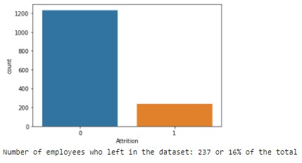
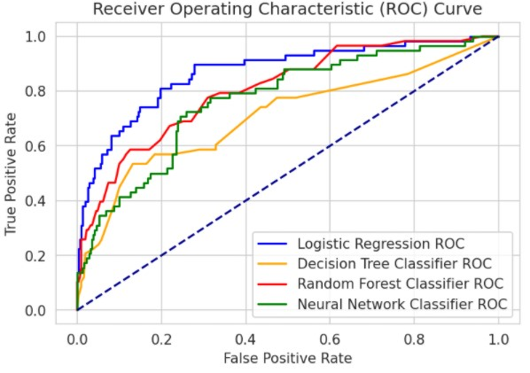

# HR-analytics-Identify-Employees-likely-to-quit
Leverage HR measures to build a classification model and detect employees likely to leave the company

This notebook aims to predict employees with the highest risk to resign. The challenge 'HR Analytics Employee Attrition & Performance' is available on kaggle with the objective to classify attrition of employees.

# Dataset
The dataset is available on kaggle [here](https://www.kaggle.com/pavansubhasht/ibm-hr-analytics-attrition-dataset). The dataset is composed of HR records on 1470 employees providing various information such as:
- age
- marital status
- years of service
- education level
- job level and job type, salary....

It also includes information on the employee's motivation, performance, working conditions etc... which can be collected by managers during appraisal and annual reviews.
All in all, the dataset contains 35 KPIs which will be used as features to develop a classification model for resignation likelyhood.

For each employee, the dataset indicates whether the employee has left the company or not. This is called 'Attrition'. This is the response variable of the project.

# Problem Statement
Companies spend a large amount of time, effort and ressources on recruitement and training. It is estimated that a recruitment process costs 15 to 20% of the employee salary. And recruitment consumes a significant amount of managers' time as well as hiring teams. It is estimated that a company loses between 1% to 2% of their turnover over time spent to bring new hires up to speed. So the overall cost of hiring and training employees is significant. The ability to retain employees is therefore extremely valuable in many ways.

In this project, the objective is to build a classifier able to indicate whether an employee is likely to resign and quit.

# Data exploration
The dataset is highly unbalanced with only 16% of the records correspondign to 'leavers'. This means that a classification model can achieve 84% accuracy by classifying all employees as 'not leavers' despite being useless.

In the exploration phase, the project :
- performs data wrangling and cleaning
- analyzes the relationship between the features and the response variable
- transforms categorical features into one_hot vectors to enable ML models

# Classification Model
I explore several ML models and compare their performance.
- Logistic regression
- Decision tree
- RandomForest (ensemble method)
- Simple fully connected neural network in tensorflow

All models suffer from the imbalanced dataset during learning phase.
To mitigate, I use:
- data augmentation with SMOTE (Synthetic Minority Over-sampling Technique)
- class weight adjustment

These techniques allow to improve the detection of the 'leavers" in the unseen test set.

# Results
From all options, the best results are achieved with Logistic Regression Classifier using SMOTE and adjusted weights to counter the class imbalance.
- Optimal adjusted weights are found using GridSearch optimizing F1 score
- Performance must be defined depending on the objective. Higher true positive detection will also lead to higher false positives.
- Best performance was 0.59 F1 score, yielding 66% detection on the true positive

Yet the performance to detect 'leavers' remains disappointing, and we must balance between improved detection but high number of false positive and disappointing detection (let's say 50% of leavers) but very low false positives. False positives are an issue as it will dilute the company attention and actions.
- To improve the model further, HR features should be enriched with new indicators more relevant to the classification task.

# Dependencies
Visualizations are performed using matplotlib, seaborn and ggplot librairies.
